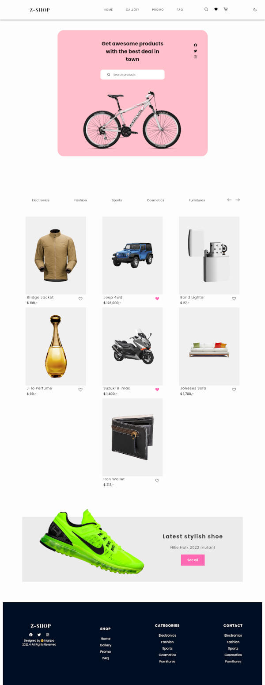

## DESCRIPTION:
- A simple E-commerce site made with React.
- [Youtube Video of the App](https://youtu.be/HvuW9dxYcVg)

## OUTCOME:
- Practise making E-commerce site with React.

## TECH STACKS:
- React,
- react-icons.
- Hooks: useState.
- styling: Styled Components.

## PROGRESS:
- Done: 100%;

## PROBLEMS:
- On bigger screen, text on "nav-menu" is missing on dark theme.

## How to run
`yarn install`
`yarn start`

## View other projects:
- [My Blog](https://dev.to/marizoo)
- [My Pinterest](https://pin.it/16vGwjy)
- [My Youtube Channel](https://www.youtube.com/channel/UCfkbnM9WvHD3mjecBiGHCBQ/playlists)

## IMAGE:
