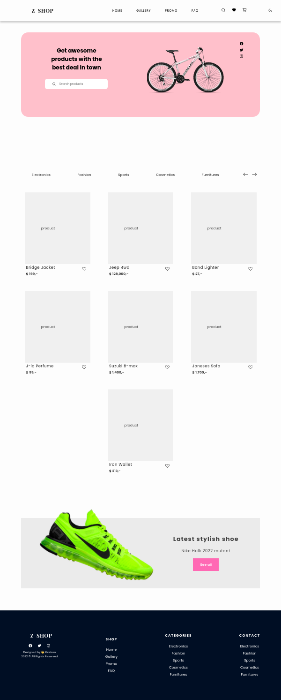

## DESCRIPTION:
- An E-commerce UI made with React + styled component.
- [Youtube Video of the App](t.b.c)

## OUTCOME:
- Built mobile first, it is responsive with light/dark theme.
- link to the UI's video on youtube: t.b.c

## TECH STACKS:
- React,
- Icons: React-icons,
- Hooks: useState.
- styling: Styled Components.

## PROGRESS:
- 70%;
- Mobile Responsive? YES.

## TODO:
### Refer to: src -> components -> Gallery.jsx.
- images won't show. 
- Fav-icon button is set to all, separate them.

## How to run
`yarn install`
`yarn start`

## View other projects:
- [My Blog](https://hashnode.com/@marizoo)
- [My Pinterest](https://pin.it/16vGwjy)
- [My Youtube Channel](https://www.youtube.com/channel/UCfkbnM9WvHD3mjecBiGHCBQ/playlists)

## IMAGE:

